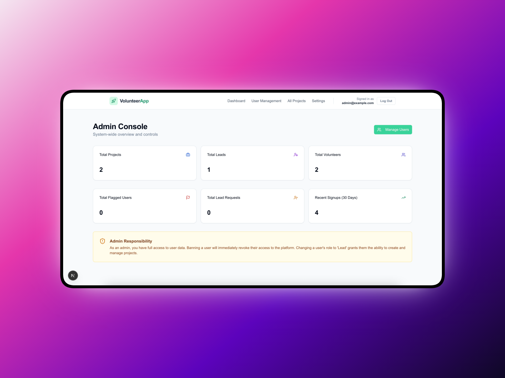

# Volunteer Management System

<p align="center">
  
  <br>
  <sub>Mockup created via <a href="https://shots.so">shots.so</a></sub>
</p>

A full-stack platform connecting volunteers with community projects. This application facilitates role-based access for Admins, Project Leads, and Volunteers to coordinate events, track enrollments, and manage community safety. 

Deployed on [Vercel](https://volunteer-projects.vercel.app).

## Features

-   **Role-Based Authentication:** Secure login for Admins, Leads, and Volunteers.
-   **Project Management:** Leads can create, update (draft/active), and delete projects.
-   **Volunteer Enrollment:** Users can browse projects and sign up with capacity limits.
-   **Admin Dashboard:** User management, banning logic, and role promotion requests.
-   **Reporting System:** Leads can report volunteers; Admins can review and dismiss reports or ban users.
-   **Responsive UI:** Built with Tailwind CSS and Shadcn/UI for a seamless experience.

## Tech Stack
-   **Framework:** Next.js (App Router, Server Actions)
-   **Database:** MongoDB (Mongoose ODM)
-   **Styling:** Tailwind CSS
-   **Components:** Shadcn/UI
-   **Notifications:** Sonner (Toast)
-   **Icons:** Lucide React

## Installation
1.  **Clone the repository**
    ```bash
    git clone https://github.com/h7dy/volunteer-projects.git
    cd volunteer-projects
    ```

2.  **Install dependencies**
    ```bash
    npm install --legacy-peer-deps
    ```

3.  **Environment Variables**
    Create a `.env.local` file in the root directory and add the following keys:
    ```env
    # Database
    MONGO_URI=your_mongodb_connection_string

    # Authentication (Auth0)
    AUTH0_DOMAIN=your_auth0_domain
    AUTH0_CLIENT_ID=your_auth0_client_id
    AUTH0_CLIENT_SECRET=your_auth0_client_secret
    AUTH0_SECRET=your_long_random_string
    
    # App Config
    APP_BASE_URL=http://localhost:3000
    ```

4.  **Run the development server**
    ```bash
    npm run dev
    ```

## Roles & Permissions

| Role | Permissions |
| :--- | :--- |
| **Volunteer** | View projects & history, Enroll/Leave projects, Request Lead access. |
| **Lead** | Create/Edit/Delete own projects, View & report enrollments, Manage project status. |
| **Admin** | Manage all users (Ban/Promote), View & review all reports, View & manage all projects. |
